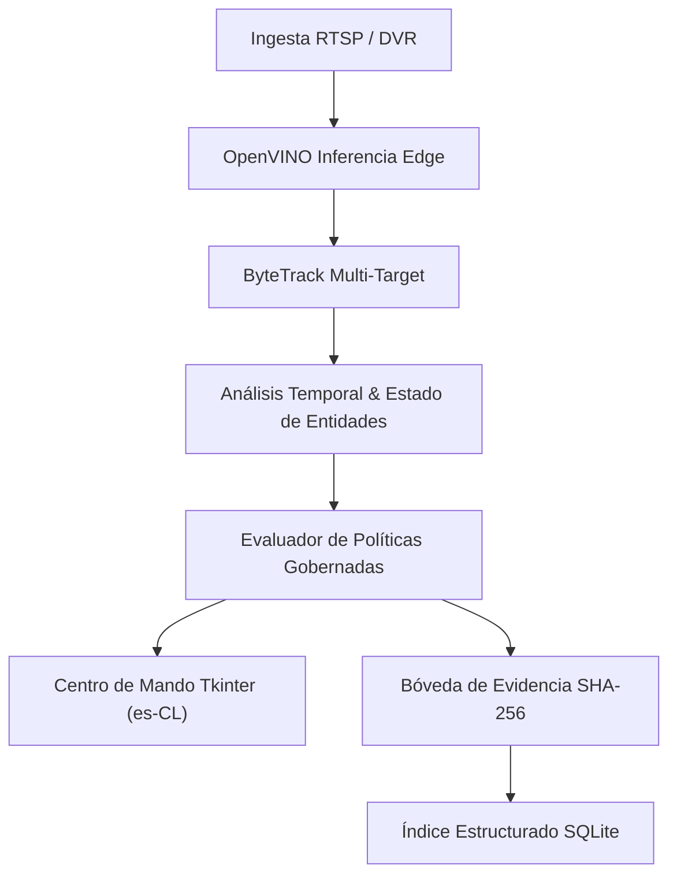

# Plan Maestro V3 — TukeVision (F12 Consolidado)

**ID de Ejecución:** `TV-F12-SURGICAL-FINAL-TRUTH-PHYSICAL-TES-03`  
**Versión:** 3.0  
**Línea Base:** Fase 12 Consolidada (Prohibido abrir F13)  

---

## 1. Visión y Arquitectura General

TukeVision V3 es una plataforma de software para centros de comando de videovigilancia retail y prevención de pérdidas que opera de manera **local-first** en hardware commodity (CPU x86_64 / Intel Iris Xe / AMD Ryzen).

### Principios Fundacionales:
1. **Límite de Grabación Primaria:** La grabación continua y retención masiva de video es responsabilidad del DVR/NVR existente (`dvr://`). TukeVision no duplica el almacenamiento NVR; preserva atómicamente paquetes de evidencia forense indexados.
2. **Cero Inteligencia Fabricada:** Todo dato presentado es `HECHO (FACT)` verificado físicamente, `INFERENCIA (INFERENCE)` determinista o `DESCONOCIDO (UNKNOWN)`. Detección / Rastreo ≠ Situación.
3. **Dominancia Visual:** En visualización en vivo, el video ocupa ≥ 80% del área de trabajo, manteniendo los paneles técnicos colapsables bajo demanda.

---

## 2. Taxonomía Formal de Madurez

Para evitar sobredeclaraciones o confusiones entre diseño conceptual y código operativo, cada subsistema se clasifica en uno de los siguientes estados canónicos:

| Estado | Definición |
| :--- | :--- |
| **`CERTIFIED`** | Código implementado, probado exhaustivamente con tests automáticos y validado físicamente en runtime sobre hardware/cámaras reales. |
| **`PHYSICALLY_VALIDATED`** | Implementado y comprobado en hardware real pero pendiente de certificación de ciclo de vida completo. |
| **`TESTED`** | Implementado y con suite de pruebas unitarias/integración completa (100% PASS) en entornos locales. |
| **`IMPLEMENTED`** | Código completo y tipado en repositorio, pendiente de pruebas de regresión ampliadas. |
| **`CONTRACT_READY`** | Modelos de datos, interfaces y contratos tipados listos para interoperar, con ejecución en hardware pendiente de periféricos (e.g. cámaras firmantes). |
| **`PARTIAL`** | Subsistema con componentes base funcionales (e.g. búsqueda estructurada SQLite) y componentes avanzados planificados (e.g. VLM NLP). |
| **`TARGET`** | Capacidad estratégica en hoja de ruta formal, no disponible en el runtime local actual. |
| **`RESERVED`** | Capacidad arquitectónicamente compatible pero deliberadamente no priorizada para el perfil edge actual. |
| **`REJECTED`** | Tecnología o patrón evaluado formalmente y descartado por sobrecarga o conflicto de diseño. |

---

## 3. Estado de los Subsistemas Clave

1. **Ingesta & Grid Multicámara (1..16 canales):** `CERTIFIED` (Estable en 1, 4, 6, 9 y 16 canales).
2. **Foco HD con Selección de Perfil MAIN:** `CERTIFIED` (Conmutación a 1080p sin pérdida de escala).
3. **Inferencia Edge OpenVINO:** `CERTIFIED` (Aceleración CPU/iGPU con fallback automático).
4. **Rastreo ByteTrack:** `CERTIFIED` (Seguimiento continuo de identidades y permanencias).
5. **Gobernanza de Autonomía & Acciones:** `CERTIFIED` (Políticas de autonomía 0 y 1 con aprobación del operador).
6. **Sistema de Diseño (DesignTokens) & Localización (`es-CL`):** `CERTIFIED`.
7. **Bóveda de Evidencia & Hash SHA-256 Local:** `CERTIFIED`.
8. **Búsqueda Estructurada de Evidencias (SQLite + `dvr://`):** `TESTED / OPERATIONAL`.
9. **Firma de Medios ONVIF:** `CONTRACT_READY` (Contratos listos, validación física no disponible por hardware de cámaras).
10. **Búsqueda Semántica / NLP Histórico:** `TARGET / CONTRACT_READY` (Búsqueda estructurada operativa; NLP en roadmap).
